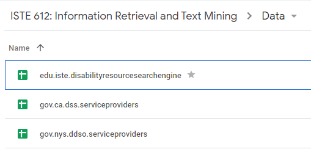
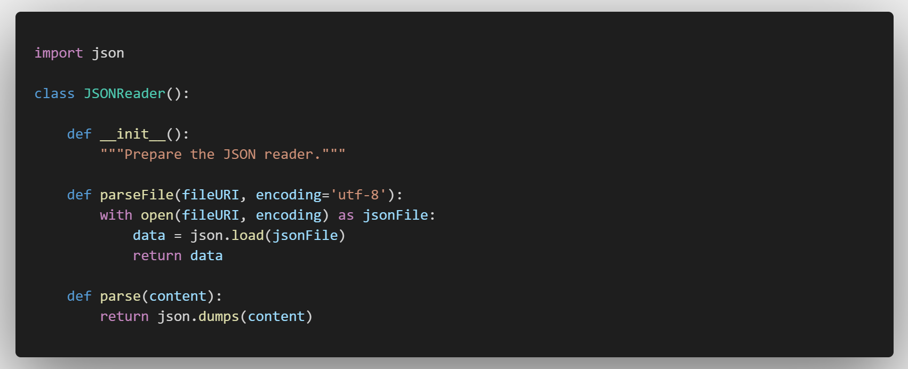

---
# -- MAIN INFO -------------------------------------------
title: "Checkpoint 2"
date: "July 9, 2021"
author: [Team Eureka]

# -- ADDITIONAL INFO -------------------------------------
subtitle: "Random Effects Experiment"
description: "ISTE 612: Information Retrieval and Text Mining | Professor Erik Golen"
lang: en-US
keywords: [project, IR, disability, resource, search, engine, services]

# -- LAYOUT ----------------------------------------------
documentclass: scrartcl
header-includes: |
    \usepackage{lmodern}
    \usepackage{xcolor}
    \usepackage{float}
    \floatplacement{figure}{H}
    \hypersetup{
        colorlinks = true,
        linkbordercolor = {white}
    }
    \newcommand{\answer}[1]{\textcolor{blue}{#1}}
    \newcommand{\question}[1]{\textcolor{black}{#1}}
    \newcommand{\task}[1]{\textcolor{yellow}{#1}}
geometry:
- a4paper
- portrait
- margin=1in
---

## Overview

This document describes the data we’ve collected, how we have collected it, where we retrieved it from, and how we will go about utilizing the data.

## Background

Team members collected publicly available data from various sources and stored them on a shared team drive. Some datasets were curated by hand, while others were scraped from webpages and search results.



To facilitate organization, the naming convention for dataset files is comparable to the Java package naming convention. Domain and source information was built into the filename.

For example, a `*.csv` file containing service providers from a state department might be named: `gov.<state>.<department>.serviceproviders.csv`. This consistent filename format could make it easier to process files in a programmatic way going forward.

To formally define the data we collected, we typically found information related to disability service providers. This included:

- `provider`: The service provider department or organization name.
- `services`: Collection of services offered by the provider.
- `category`: The disability category the service provider is most affiliated with (eg., `Vision`, `Hearing`, `Cognitive`, etc.)
- `location`: Provider location of varying specificity. Could be at the `city`, `county`, `state` or `federal` levels.
- `website`: URL to the provider website, to help with deduplication across forms and aid in classifying providers.
- `keywords`: (Optional) If possible, collection included the selection of keywords associated with the entry.

## Datasets

Collecting data for all disability resources across the country is too large of a scope for a proof-of-concept project like this. We've narrowed our data selection to a subset of locations: particularly, New York, California, and Ohio. This ability to access data on these locations was easiest.

Daniel is in the process of writing a web scraper to scrape the REACH website for different services. Ian has curated a collection of service providers stemming from various online resources and provided this inforamtion on the shared team drive. Some of the information needs to be deduplicated.

Service providers are not always disability resource specific, but these datasets include taxanomy fields that allow us to filter out and sort based on particular service groups.

### edu.iste.disabilityresourcesearchengine.xlsx | ([Link to data](https://docs.google.com/spreadsheets/d/19a5TcHZ1KCLmF9EfcKlRfgcuTXRgeiLD6yPax-OyX_o/edit?usp=sharing))

A collection of sheets in an Excel/Google Sheets workbook containing lookup information:

- `disability_category`: Contains legend for disability categories, as defined by the [US Census](https://www.census.gov/library/visualizations/2019/comm/types-of-disabilities.html).
- `service_category`: Contains categories and definitions for types of accessibility and assistance services, as defined by the [California Department of Social Services](https://www.cdss.ca.gov/deaf-access).
- `states`: Contains states, common abbreviations, and codes, alongside population counts for ranking, from the [World Population Review](https://worldpopulationreview.com/states/state-abbreviations).
- `zipcodes`: Contains zipcodes, cities, and counties, along with population counts, sourced from the [World Population Review](https://worldpopulationreview.com/zips).

### gov.nys.serviceproviders.xlsx | ([Link to data](https://docs.google.com/spreadsheets/d/1TGNebYqKdElQANp6TyZuqLN3WH0vBEqgHw5FRHX-vsg/edit?usp=sharing))

Collection of sheets detailing service providers from New York state.

- `ddso_service_providers`: Entries with ($n=533$) agencies that provide developmental disability services, collected by the [New York State Office for People With Developmental Disabilities (NYS OPWDD)](https://data.ny.gov/Human-Services/Directory-of-Developmental-Disabilities-Service-Pr/ieqx-cqyk).

- `ddso_discharge_facilities`: Additional DDSO facilities ($n=14$), provided by [NY Department of Health](https://www.health.ny.gov/professionals/patients/discharge_planning/pasrr_coordinators.htm).

- `ofa_service_providers`: Centers for Independent-Living facilities ($n=238$), provided by [NYS Office for the Aging (OFA)](https://data.ny.gov/Human-Services/Directory-of-Aging-and-Disability-Community-Resour/jwv3-3scj).

- `cil_service_providers`: (WIP) Table containing Centers for Independent Living in New York, collected from [the ILRU (Independent Living Research Utilization)(ILRU)](https://www.ilru.org/projects/cil-net/cil-center-and-association-directory-results/NY).

### gov.ca.serviceproviders.xlsx | ([Link to data](https://docs.google.com/spreadsheets/d/1XsvpB1lngFnLAVOR2YosWm-TXqtF20AT1NzFasItKH4/edit?usp=sharing))

Collection of sheets detailing service providers from California state:

- `dss_service_providers`: Service providers dataset ($n=1718$) provided by [California Health and Human Services](https://data.chhs.ca.gov/). Found through [data.world](https://data.world/chhs/e8d55304-b058-41de-a59f-4f646d792c11).

- `cil_service_providers`: (WIP) Table containing Centers for Independent Living in California, collected from [the ILRU (Independent Living Research Utilization)(ILRU)](https://www.ilru.org/projects/cil-net/cil-center-and-association-directory-results/CA).

### org.handson.ohio.serviceproviders.json | ([Link to Data](https://drive.google.com/file/d/1tUFmM-cx-bZCMpXzeDHueKl0RUqNUmmA/view?usp=sharing))

This is a [collection of Service Providers](https://discovery.smartcolumbusos.com/dataset/handson_central_ohio/community_services_agencies) ($n > 1000$) from LSS 211 Central Ohio (formerly known as Hands On Central Ohio). JSON format served as inspiration on how to organize our document data (which we go into for our next steps).

## Next Steps

These tasks have been split between Daniel and Ian. In the meantime, Ben is researching the API requirements to provide Power BI with an endpoint.

### Cleaning the Data

We are approximately 90% through collecting our data. In particular, we need to convert Daniel's web scraping results into a compatible schema to include REACH services. Additionally, we need to fill in the tables with the information from [the ILRU (Independent Living Research Utilization)(ILRU)](https://www.ilru.org/projects/cil-net/cil-center-and-association-directory-results) datasets - this should be done by Saturday, July 10th.

Once this collection process is complete, we'll need to clean the data and ensure it is deduplicated, which we can complete using Python tools such as `pandas`.

### Preparing the Data for Indexing

Data has been tidied and deduplicated, the next step of the process is to prepare our data sources for querying. We will want to normalize and consolidate our information into a set of JSON documents that can then be indexed. The JSON format offers us a decent amount of flexibility. 

This step allows us to have a consistent schema (with optional fields) across datasets. Tools exist that will allow us to convert JSON into database and API schema as well: the [`generate-schema` CLI](https://github.com/Nijikokun/generate-schema) from [@Nijikokun](https://github.com/nijikokun). To minimize the impact on storage spacae, we can ingest our JSON files into a MongoDB instance as Binary-JSON (BSON) files.

JSON data can be read natively using Python. Our simple `read_json.py` exposes a JSONReader class that can parse stringified JSON and parse `*.json` files into Python `dict`s:



For a single service provider that offers multiple services, the JSON structure might look like:

```json
[
    {
        "provider": "<provider name>",
        "services": [
            "<service category>",
            "<service category>",
            "<service category>",
        ],
        // Does this provider focus on a specific assistance category?
        "category": "<disability category>",
        "website": {
            "url": "<url>",
            "domain": "<domain name>",
            // eg., '.gov' can help classify providers.
            "tld": "<top-level domain>", 
        },
        // Contact information, if present in original dataset.
        "contact": {
            "email": "<email address>",
            "phone": "<phone number>",
        },
        // Array if provider has multiple locations.
        "location": [
            {
                // Optional fields.
                "line1": "<address line>",
                "line2": "<address line>",
                "line3": "<address line>",
                "city": "<city>",
                "state": "<state>",
                "county": "<county>",
                "zip": "<zipcode>"
            }
        ],
        // String keywords.
        "keywords": [ ]
    }
]
```

Missing fields can simply be omitted and can be handled appropriately from the frontend.
